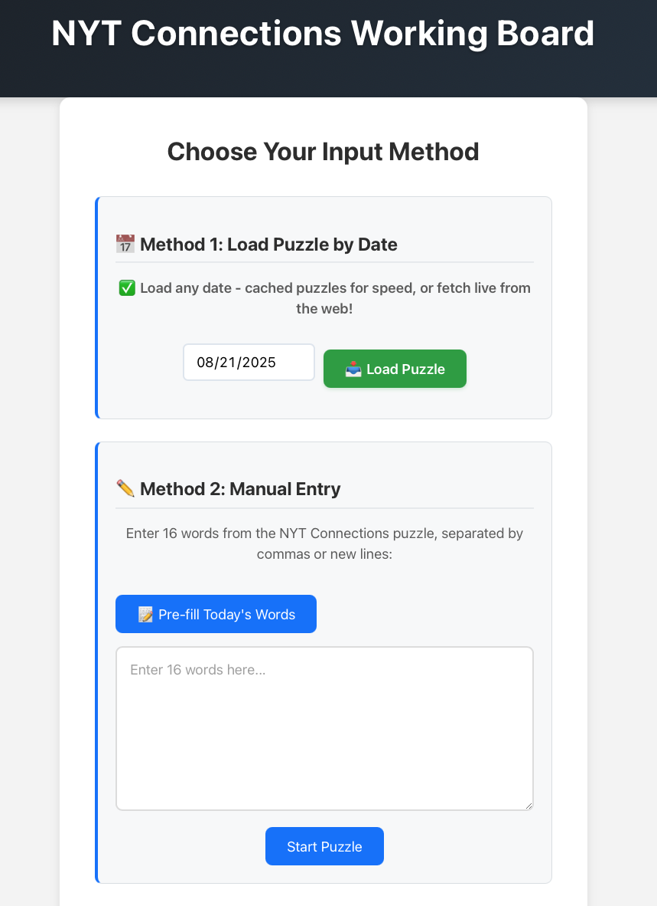
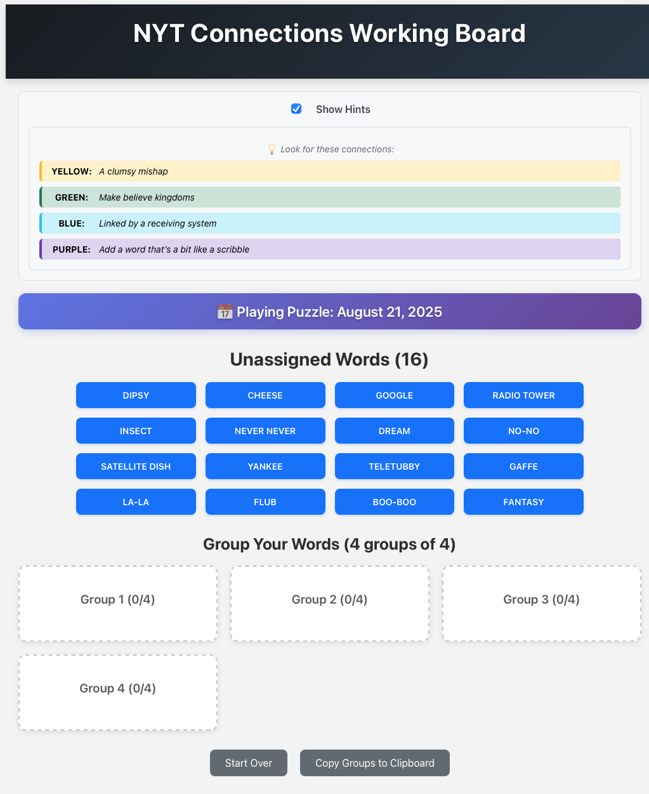

# NYT Connections Working Board

A web-based tool for solving NYT Connections puzzles by organizing words into groups without making guesses in the real game.

## Project Overview

The NYT Connections Working Board is a React-based web application that allows users to input the 16 words from a NYT Connections puzzle and organize them into groups of 4. This helps users work out the correct groupings before attempting the actual puzzle, avoiding the frustration of making incorrect guesses.

## Technology Stack

- **Frontend**: React.js with modern hooks
- **Styling**: CSS3 with responsive design
- **Testing**: Jest + React Testing Library
- **Deployment**: Static hosting (any platform)
- **Build**: Create React App with npm

## Current Features

- **Manual Word Input**: Enter 16 words via textarea or paste from ChatGPT
- **Drag & Drop Grouping**: Organize words into 4 groups of 4
- **URL Persistence**: Game state survives page refreshes
- **Mobile Optimized**: Responsive design that works great on iPhone
- **Dynamic Font Sizing**: Automatically adjusts text size to fit long words
- **Smart Word Input**: Streamlined ChatGPT workflow for easy word extraction

## How to Use

### Method 1: ChatGPT + Screenshot (Recommended)
1. Take a screenshot of the NYT Connections puzzle grid
2. Upload it to ChatGPT and ask: "What are the 16 words in this NYT Connections puzzle? Please list them separated by commas."
3. Copy the response and paste it into the textarea
4. Click "Start Puzzle" to begin organizing!

### Method 2: Manual Entry
1. Type or paste the 16 words into the textarea
2. Separate words with commas or new lines
3. Click "Start Puzzle" to begin organizing!

## Screenshots

### 1. Input Screen - Getting Started


**Start here!** Enter the 16 words from your NYT Connections puzzle. You can either type them manually or use the ChatGPT method (recommended) by taking a screenshot and asking ChatGPT to identify the words. The app will validate that you have exactly 16 words before starting the puzzle.

### 2. Grouped Hints - Working Out the Connections


**Organize and solve!** Once you start the puzzle, drag and drop words into groups of 4. This screenshot shows how the app makes it easy to work out the correct groupings without having to make guesses in the real NYT Connections app. For example, with the words "PLAYWRIGHT", "DEAN", "ROOF", "TEMPLE", "FACULTY", "WREATH", "BENT", "SWORD", "GARLAND", "HAY", "GIFT", "WRAP", "JACKPOT", "FLAIR", "GABLE", "ROAD", you can organize them into logical groups like:

- **Yellow: Aptitude** - BENT, FACULTY, FLAIR, GIFT
- **Green: Silent "W"** - PLAYWRIGHT, SWORD, WRAP, WREATH (words that start with silent W)
- **Blue: Legends of classic Hollywood** - DEAN, GABLE, GARLAND, TEMPLE
- **Purple: Hit the ___** - HAY, JACKPOT, ROAD, ROOF (forming phrases like "Hit the Hay", "Hit the Road", etc.)

## Smart Word Input

The app provides a streamlined workflow for using ChatGPT to extract puzzle words:

- **Screenshot Method**: Take a photo of the puzzle grid and ask ChatGPT to identify the words
- **Copy-to-Clipboard**: One-click copying of the perfect ChatGPT prompt
- **Automatic Parsing**: Handles various separators (commas, newlines, mixed)
- **Input Validation**: Ensures exactly 16 words before starting

## Development Phases

- ✅ **Phase 1 - Setup & Scaffolding**: Basic React app with header
- ✅ **Phase 2 - MVP: Manual Input + Dragging**: Core drag-and-drop functionality
- ✅ **Phase 3 - Smart Input Methods**: ChatGPT workflow and copy-to-clipboard
- ✅ **Phase 4 - Mobile Optimization**: Responsive design and iPhone-friendly layout
- ✅ **Phase 5 - URL Persistence**: Game state survives page refreshes
- ✅ **Phase 6 - Dynamic Typography**: Smart font sizing for long words

## Deployment

The app can be deployed to any static hosting platform:

1. **Build the app**: `npm run build`
2. **Deploy options**:
   - **Netlify**: Drag and drop the `build/` folder
   - **Vercel**: Connect your GitHub repo for automatic deployments
   - **GitHub Pages**: Enable Pages in your repo settings
   - **Firebase Hosting**: Use Firebase CLI to deploy
   - **Any static host**: Upload the `build/` folder contents

**Note**: The app is a static React build, so it works on any web hosting service.

## Local Development

```bash
# Install dependencies
npm install

# Start development server
npm start

# Run tests
npm test

# Build for production
npm run build
```

## Testing

The app includes comprehensive tests that run automatically:

- **Unit Tests**: 18 tests covering core functionality
- **CI Integration**: Tests run on every commit (GitHub Actions, GitLab CI, etc.)
- **Coverage**: Tests cover input validation, drag-and-drop, and UI components

## Contributing

1. Fork the repository
2. Create a feature branch
3. Make your changes
4. Run tests: `npm run test:ci`
5. Commit and push
6. Create a pull request

## License

This project is open source and available under the MIT License.
